# Data & Retention Architecture

Where state lives, who reads it, over what window, and how long it survives.

The distinction that matters throughout: **read window ≠ retention.** Most
readers here ask for 7–30 days. Until 2026-08 almost nothing had a retention
policy at all, so the gap between those two numbers was unbounded.

---

## Storage map

```mermaid
flowchart TB
    subgraph S3["S3 — news-ai-agent-results-645949963620 (versioned)"]
        P["<b>posts_*.json</b><br/>published post + selection reason<br/>+ scores + runner-ups + footage audit"]
        A["<b>articles_*.json</b><br/>candidate pool + excluded_reason"]
        PR["<b>pipeline_results_*.json</b><br/>per-run status"]
        MA["metrics/account/YYYY-MM-DD.json"]
        AN["analytics/weekly_*.json"]
        FA["facts/pool.json · facts/_rotation.json"]
        VI["viral/_skip_state.json"]
        CQ["<b>code_quality/history.json</b> (new)"]
        ER["errors/*.json"]
        RE["reels/*.mp4 · facts/*.mp4"]
    end

    subgraph DDB["DynamoDB"]
        PM[("post-metrics<br/><b>TTL 730d</b>")]
        PV[("prompt-versions<br/><b>no TTL</b>")]
    end

    P --> R1["get_published_urls()<br/><b>ALL-TIME</b> URL dedup"]
    P --> R2["selection_reviewer · 7d"]
    A --> R2
    PM --> R3["analytics_engine · 30d"]
    PM --> R2
    PM --> R4["viral_guard · median baseline"]
    CQ --> R5["weekly email · 7d"]

    style P fill:#fce8e6,stroke:#c5221f
    style PM fill:#e8f0fe,stroke:#1a73e8
    style PV fill:#fef7e0,stroke:#f9ab00
```

---

## Retention

| Location | Read window | Retention | Rule |
|---|---|---|---|
| `posts_*.json` | **all-time** (URL dedup) + 7d/30d | **forever**, STANDARD_IA after 90d | `cool-posts-after-90-days` |
| `articles_*.json` | 7 days | 730 days | `expire-articles-after-730-days` |
| `pipeline_results_*.json` | never read programmatically | 730 days | `expire-pipeline-results-after-730-days` |
| `errors/` | manual | 30 days | pre-existing |
| `analytics/` | previous week | Glacier at 90d | pre-existing |
| `metrics/account/` | 30 days | Glacier at 365d | pre-existing |
| `facts/carousel/` | minutes | Glacier at 90d | pre-existing |
| any non-current version | — | 730 days | `expire-noncurrent-versions-after-730-days` |
| `post-metrics` (DynamoDB) | 7–30 days | **730 days** (TTL on `expires_at`) | `analytics.tf` |
| `prompt-versions` (DynamoDB) | on demand | **forever, deliberately** | rollback surface |
| CloudWatch logs | debugging | 7 / 14 / 30 days | unchanged |

### Why `posts_` is exempt from Glacier and expiry

`lambda_handler.get_published_urls()` reads the **body** of every `posts_*.json`
on every run to build the all-time published-URL set. Glacier objects cannot be
read without a restore, so archiving this prefix would break URL dedup, the
3-day title window, the 7-day content mix, the violence cap and footage dedup
simultaneously — and expiring it would let a two-year-old article be republished
as new.

STANDARD_IA keeps every object directly readable at roughly half the storage
cost. Bounding this prefix properly requires a **compact all-time URL ledger** so
the dedup scan stops depending on the raw objects. Until that exists, "cheaper
but still readable" is the honest ceiling.

### Why `prompt-versions` has no TTL

It is the recovery path for `analytics_engine`'s auto-applied prompt changes
(confidence > 0.80, no human review). Expiring rows quietly shortens how far back
a rollback reaches. If it ever needs bounding, cap by **count per prompt_name**,
not by age — an old prompt that was working is exactly what you want to return to.

### DynamoDB TTL only deletes items that carry the attribute

Enabling the TTL affects future writes only. Rows written before
`metrics_collector` started stamping `expires_at` have no such attribute and
would live forever. `local_only/backfill_metrics_ttl.py` stamps them once.

`expires_at` is anchored to **`published_at`, not to collection time** —
`collect()` re-writes the trailing 30 days on every daily run, so a `now`-anchored
expiry would slide forward on every pass and never actually age out.

---

## Two silent-truncation bugs fixed alongside

Both had the same shape: a paginated API read as if it returned everything.

**`get_published_urls` — the dated one.** `list_objects_v2` caps at 1000 keys.
At 2 posts/day the `posts_` prefix crosses 1000 objects around **day 500
(≈ mid-2027)**. Because keys sort as `posts_YYYYMMDD_HHMMSS`, an unpaginated read
returns the *oldest* 1000 — every recent post drops out of the window at once,
with no error. `selection_reviewer._list_recent` already paginated the same
prefix, so the two readers disagreed.

**`_load_previous_analysis` — already firing.** It took `MaxKeys=10` and sorted
that page by `LastModified`. S3 returns keys lexicographically, so once more than
ten `analytics/weekly_*` objects existed — after ten weeks — that page held the
ten *oldest* files and "last week's analysis" became an ancient one. The
week-over-week delta in the analytics email has been comparing against the wrong
baseline. Now paginates and sorts by key, which for `weekly_YYYY-MM-DD.json` is
chronological.

---

## Cost characteristics worth knowing

- **Both `post-metrics` readers use `scan` + `FilterExpression`**, not the
  `by_published_at` GSI that exists with `projection_type = "ALL"`. The filter is
  applied *after* the scan reads every item, so read cost tracked total table
  size — which, with no TTL, grew without bound. The TTL caps that; switching the
  readers to the GSI would be the real fix.
- **`selection_reviewer._list_recent` filters client-side by timestamp parsed
  from the key**, so its listing cost tracks total bucket contents rather than the
  7-day window. The `articles_` expiry now bounds that.
- **The `by_published_at` GSI is unused and projects `ALL`**, roughly doubling the
  storage of every item for no reader.

See [`sdlc.md`](sdlc.md) for the delivery pipeline and [`runtime.md`](runtime.md)
for what produces this data.
