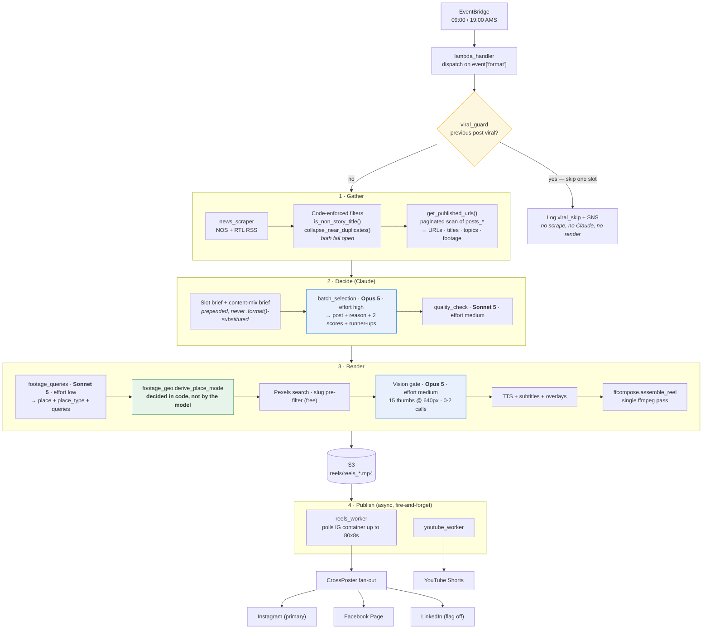
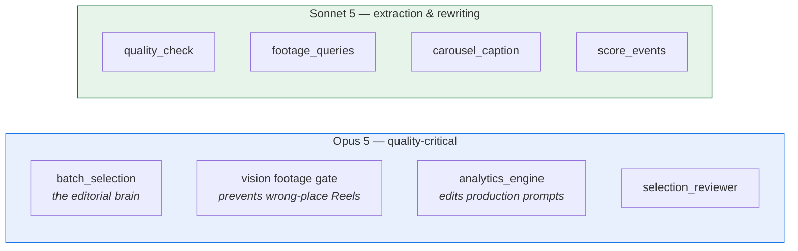
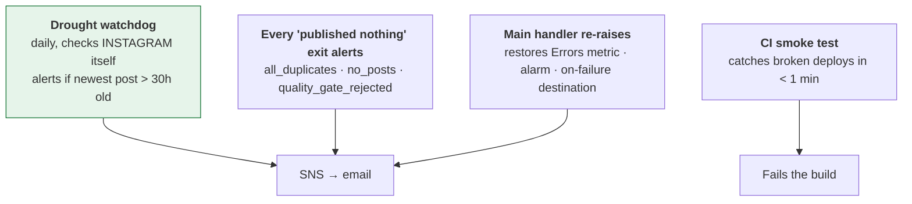

# Runtime Architecture

What the deployed system does. Four Lambda functions, ten EventBridge rules
(two disabled), one S3 bucket, two DynamoDB tables.

**All crons below are UTC in Terraform.** Amsterdam local times assume CEST
(UTC+2) and are off by one hour in winter — a known gotcha, and the reason
"move the evening post to 19:00 CEST instead of 17:00 UTC" is a request for
what already ships.

---

## Schedules

| EventBridge rule | Cron (UTC) | AMS (CEST) | Payload → pipeline | State |
|---|---|---|---|---|
| `daily_fact_schedule` | `cron(0 6 * * ? *)` | 08:00 | `{"format":"daily_fact"}` | ENABLED |
| `morning_schedule` | `cron(0 7 * * ? *)` | 09:00 | `{"schedule":"morning"}` → news | ENABLED |
| `afternoon_schedule` | `cron(0 17 * * ? *)` | 19:00 | `{"schedule":"evening"}` → news | ENABLED |
| `fact_carousel_sunday` | `cron(0 10 ? * SUN *)` | Sun 12:00 | `{"format":"fact_carousel"}` | ENABLED |
| `selection_reviewer_schedule` | `cron(0 17 ? * SUN *)` | Sun 19:00 | weekly editorial review | ENABLED |
| `analytics_engine_schedule` | `cron(0 20 ? * SUN *)` | Sun 22:00 | weekly analytics + prompt update | ENABLED |
| `metrics_collector_schedule` | `cron(0 0 * * ? *)` | 02:00 | Instagram Insights → DynamoDB | ENABLED |
| `token_refresh_schedule` | `rate(30 days)` | — | 60-day IG token refresh | ENABLED |
| `evening_schedule` | `cron(30 16 * * ? *)` | 18:30 | — | **DISABLED** |
| `events_thursday_schedule` | `cron(0 16 ? * THU *)` | Thu 18:00 | events post | **DISABLED** |

The events post is disabled at **two** layers: this rule, and the
`ENABLE_EVENT_POSTS` flag in Secrets Manager. Re-enabling needs both.

---

## The news pipeline

### Why Reels publish from a separate Lambda

Meta's video processing takes up to 10 minutes; the main Lambda has a 15-minute
hard limit. The main handler renders, uploads to S3, then invokes
`reels_worker` and `youtube_worker` asynchronously and returns.

**The two worker Lambdas must never re-raise.** They run with `retries = 2`, so
a failure *after* Instagram accepted the container would republish the post.
They alert and return 500 instead. The main handler does the opposite — it
re-raises after alerting, which is safe only because it runs with
`maximum_retry_attempts = 0`. This asymmetry is the easiest thing in the
codebase to "fix" wrongly.

---

## Model routing

Retuned 2026-08. Every knob is env-overridable via Secrets Manager, no deploy.

`VISION_MODEL` is a **separate knob from `REVIEW_MODEL`**. They shared one
variable until this retune, so lowering `REVIEW_MODEL` to save money on
`quality_check` would silently have downgraded the footage gate — a cost tweak
landing as a correctness regression.

Every call goes through `NewsAIAgent._create`, which sets `output_config.effort`
and emits a structured `claude_usage` log line (tokens + estimated cost per
role). No call site set effort before this change, so everything ran at the API
default of `high`.

---

## Other pipelines

| Format | Trigger | Output | Notes |
|---|---|---|---|
| `daily_fact` | 08:00 daily | Instagram **Story only** | No TTS. Deliberately not a Reel — news already posts 2/day. Story video goes through `reels_worker` so Meta's processing is off the main clock. |
| `fact_carousel` | Sun 12:00 | Instagram **carousel** | The week's Story facts. Instagram-only: carousels don't fit the single-`media_url` CrossPoster shape. |
| `event_post` | Thu 18:00 | — | **Disabled at two layers.** |
| photo post | fallback | Instagram + Facebook | When Reels rendering is unavailable. |

**Channel exclusions are enforced by content source, not by channel name.**
`build_crossposter(content_source="event")` skips LinkedIn; call sites never
name a channel. YouTube and LinkedIn both take news Reels only — an event
slideshow misaligns with the news-channel identity needed for monetisation.

---

## Failure visibility

Four independent layers, because cause-based alerting cannot cover an unforeseen
regression:

The watchdog is the catch-all: it verifies **at the destination**, so it catches
every failure class without needing to know the cause. It must never be pointed
at `posts_*.json` — that file is written even when publishing later fails, so S3
cannot answer "did we actually publish".

See [`sdlc.md`](sdlc.md) for how code reaches production and [`data.md`](data.md)
for storage and retention.
