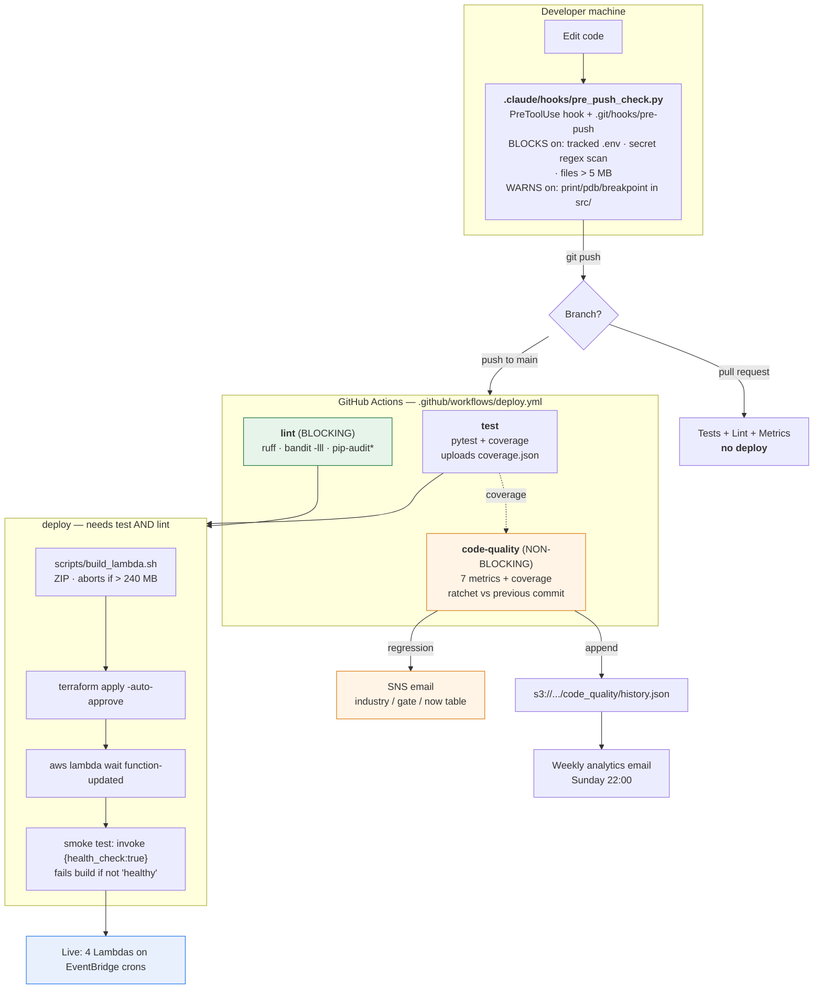
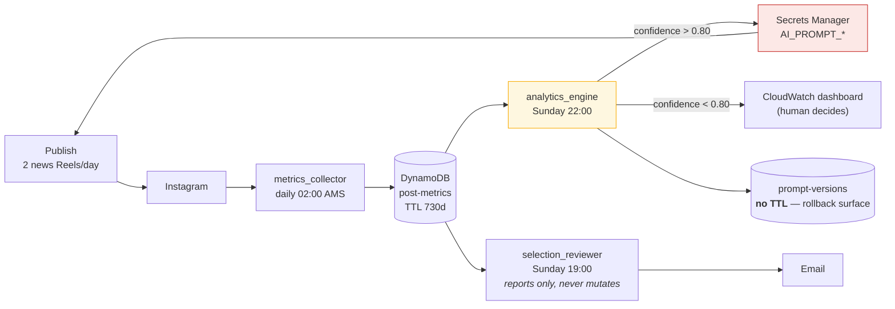

# SDLC Architecture

How a change gets from an editor to production, what checks it passes, and —
just as importantly — **what nothing checks**.

The defining property of this pipeline: **a push to `main` IS the deploy.** There
is no staging environment, no manual approval, no rollback step, and no
`terraform plan` on pull requests. `terraform apply -auto-approve` runs on every
push to `main`.

---

## The pipeline



`*` pip-audit is `continue-on-error` — a CVE disclosed in a transitive dependency
should be visible, but is not a reason to stop shipping an unrelated fix.

---

## Why `code-quality` does not block the deploy

`deploy` depends on `test` and `lint` only. This is deliberate and it is the one
asymmetry worth understanding:

| Gate | Blocks deploy? | Reasoning |
|---|---|---|
| `test` | **Yes** | A failing test is a defect. Blocking leaves the previous working version running on its cron — the account keeps publishing. |
| `lint` (ruff, bandit HIGH) | **Yes** | Deterministic and fixable once. Same safety property: a blocked deploy is not an outage. |
| `pip-audit` | No | A third party disclosing a CVE should not block your hotfix. |
| `code-quality` | **No** | A *ratchet* metric is a judgement call. One legitimate refactor that raises complexity must not block a production fix. The requested behaviour was an email. |

The general rule: **block on facts, mail on judgements.**

---

## What each gate actually catches

| Stage | Catches | Misses |
|---|---|---|
| Pre-push hook | Committed secrets, tracked `.env`, huge files, stray `print`/`pdb` | Everything else — and **it only exists on the developer's machine**; CI does not replicate the secret scan |
| `test` | Logic regressions across 479 tests | Anything untested — coverage is 55.6% |
| `lint` | Undefined names, unused imports, bugbear traps, HIGH-severity security | Style (deliberately narrow rule set), typing (mypy not enforced) |
| `code-quality` | Complexity/duplication/coupling drift vs the previous commit | Nothing at all on the first run — it needs a baseline |
| `build_lambda.sh` | ZIP over 240 MB (Lambda's hard limit is 250) | Whether the code inside works |
| `terraform apply` | Malformed infrastructure | That the ZIP it just uploaded actually loads |
| Smoke test | Broken imports, broken handler, bad `get_secrets()` | Anything past the health-check early return |

**The smoke test is the load-bearing one.** `terraform apply` only confirms the
ZIP was uploaded. Without the smoke test, a broken import stays green until the
next cron fires — up to 13 hours later.

---

## What nothing checks

Stated plainly, because a diagram that only shows the happy path is misleading:

1. **No rollback.** A bad commit that passes tests, lint and the smoke test is
   live until a human pushes a fix forward. The only recovery is roll-forward.
2. **No staging.** There is one environment. `terraform.tfvars.ci` is the only
   variable set.
3. **No `terraform plan` on PRs.** Infrastructure changes are reviewed as code
   diffs, never as a plan. A destructive change is visible only in the apply log
   of the run that already performed it.
4. **The deploy role is not in Terraform.** `grep -rn 'aws_iam_role"' infrastructure/terraform/`
   returns `lambda_role` and `glue_role` only. The GitHub OIDC role that runs
   `terraform apply` was created out of band and lives solely as
   `secrets.AWS_ROLE_ARN`. It is the most privileged credential in the system and
   the one thing here that cannot be audited from the repo.
5. **The secret scan is local-only.** `.claude/hooks/pre_push_check.py` runs on
   the developer machine. A push from anywhere else bypasses it entirely.
6. **`check_readme_freshness()` is dead code** — defined in the pre-push hook,
   never called from `main()`. The "source changed without README" check has been
   silently inactive.

---

## The feedback loop

The genuinely unusual part of this system: **production output edits production
configuration, automatically.**



Two properties of this loop matter more than anything else in the diagram:

- **`analytics_engine` writes to Secrets Manager without human review** when its
  confidence exceeds 0.80. Prompts are therefore *production state that changes
  without a deploy* — and consequently without passing any gate above. The
  `prompt-versions` table is the only way back, which is why it is deliberately
  exempt from the 2-year TTL.
- **`selection_reviewer` reports and never mutates.** That asymmetry is
  intentional: the reviewer reasons about editorial judgement, where a wrong
  auto-applied conclusion compounds.

The loop's known failure mode is documented in CLAUDE.md: the reviewer's payload
omitted `shares`, so it recommended save-optimisation, the prompt adopted it, and
no metric the reviewer could see moved while the account lost its breakout tail.
**A rule whose metric the loop cannot observe cannot be corrected by the loop.**

---

## Local commands

```bash
make test                       # pytest tests/ -v
ruff check .                    # same rule set CI blocks on
bandit -c pyproject.toml -r src/ lambda_handler.py -lll
python scripts/code_quality/analyze.py .        # the 7 metrics
python scripts/code_quality/gate.py result.json # compare + table
```

See [`runtime.md`](runtime.md) for what the deployed system does, and
[`data.md`](data.md) for where state lives and how long it survives.
